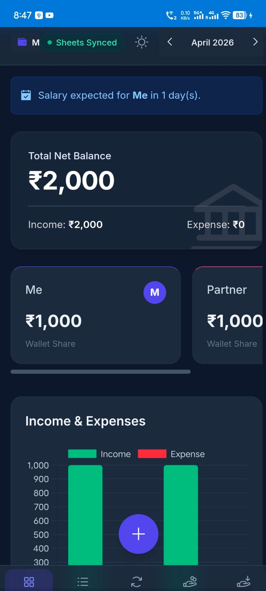
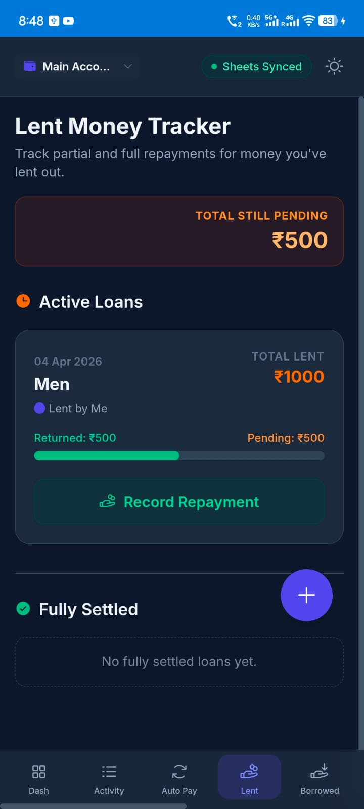
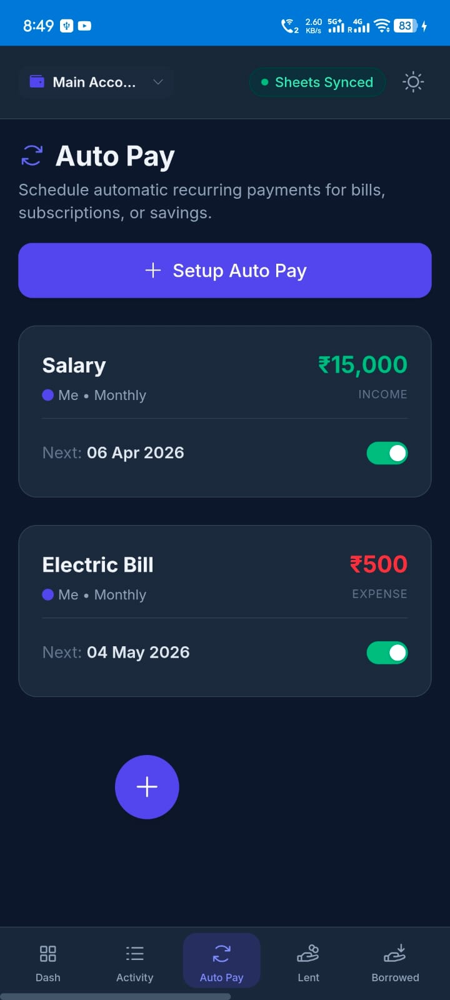
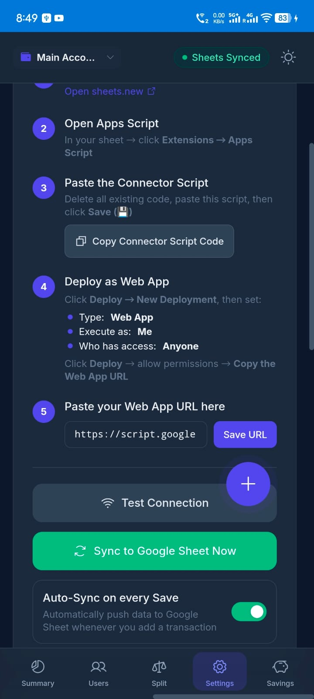

# **💳 San Pay Note \- Android Expense & Debt Manager**

**San Pay Note** is a powerful, privacy-first Android application designed to help individuals, couples, and groups manage their shared finances, track debts, and automate recurring bills.

Everything stays on your device natively, with an exclusive one-click backup system that syncs your data directly to your personal Google Sheets. No third-party servers, no forced sign-ups\!

## **✨ Key Features**

* 📊 **Smart Dashboard:** Get a bird's-eye view of your total net balance, income, expenses, and visual charts representing wallet shares.  
* 🤝 **Multi-Person Management:** Add multiple users (e.g., yourself, partner, roommates) with custom colors and track individual balances within the same account.  
* 🔄 **Auto Pay Engine:** Automate your recurring bills, subscriptions, and salary entries. Set it to Daily, Weekly, Monthly, or Yearly, and the app will generate the transactions automatically.  
* 💸 **Lent & Borrowed Trackers:** Never forget a debt again. Track money you owe and money owed to you. Supports **partial repayments**, progress bars, and full settlements.  
* ⚖️ **Fair Proportional Split:** Instantly calculate how much each person should contribute to a specific target amount (like rent or a vacation) based on their current positive wallet balance.  
* 📱 **UPI Integration:** Seamlessly opens your phone's native UPI apps (GPay, PhonePe, Paytm) right after logging a payment or expense.  
* ☁️ **Google Sheets Sync:** Connect the app to your own Google Sheet. Includes an "Auto-Sync" toggle to silently push your latest transactions, user balances, and monthly summaries directly to the cloud.  
* 🖨️ **Professional PDF & Print Export:** Generate beautifully formatted, printable A4 PDF reports of your transaction history and user balances.  
* 💾 **Local Backup & Excel Export:** Export your entire database to a detailed Multi-Sheet Excel file or JSON backup.  
* 🌙 **Dynamic Theming:** Beautiful Light and Dark modes tailored to your system preferences.

## **📸 Screenshots**

*(Add screenshots of your Android app here)*

| **Dashboard** | **Lent Tracker** | **Auto Pay** | **Google Sheets Sync** |

| \ | \ | \ | \ |

## **🛠️ Installation**

1. Go to the [Releases](https://www.google.com/search?q=../../releases) tab on this repository.  
2. Download the latest SharedWallet-v1.x.x.apk file.  
3. Transfer the APK to your Android device.  
4. Enable "Install from Unknown Sources" in your Android settings.  
5. Tap the APK to install and launch the app\!

## **🔗 Connecting to Google Sheets (Optional)**

Shared Wallet allows you to turn your own Google Drive into a private backend database.

1. Create a new Google Sheet (sheets.new).  
2. Go to **Extensions \> Apps Script**.  
3. Copy the Connector Script provided inside the App's **Settings** menu and paste it into the script editor.  
4. Click **Deploy \> New Deployment**. Set Type to "Web App", Execute as "Me", and Who has access to "Anyone".  
5. Copy the generated Web App URL and paste it into the Shared Wallet app settings.  
6. Toggle **Auto-Sync** ON\!

## **💻 Tech Stack & Architecture**

While packaged as a fast, lightweight Android App, the core logic utilizes modern mobile UI frameworks:

* **Styling:** Tailwind CSS architecture for fluid, responsive mobile layouts.  
* **Charts:** Chart.js for smooth data visualization.  
* **PDF Generation:** Native Print/PDF generation hooks for flawless A4 rendering.  
* **Data Export:** XLSX.js for generating multi-sheet Excel workbooks natively on the device.  
* **Storage:** Secure Android LocalStorage (No cloud databases used unless explicitly linked to the user's Google Sheet).

## **🔐 Privacy by Design**

**Your data belongs to you.** Shared Wallet does not collect, transmit, or sell your financial data. All transactions and user details are securely stored locally on your Android device. The only network request the app makes is to your own personal Google Apps Script URL if you explicitly configure the Google Sheets Sync.

## **👨‍💻 Developer**

**Developed by Santhosh A**

* [Portfolio / Hub](https://a-santhosh-hub.github.io/in/)

## **📜 License**

This project is open-source and available under the [MIT License](https://www.google.com/search?q=LICENSE).